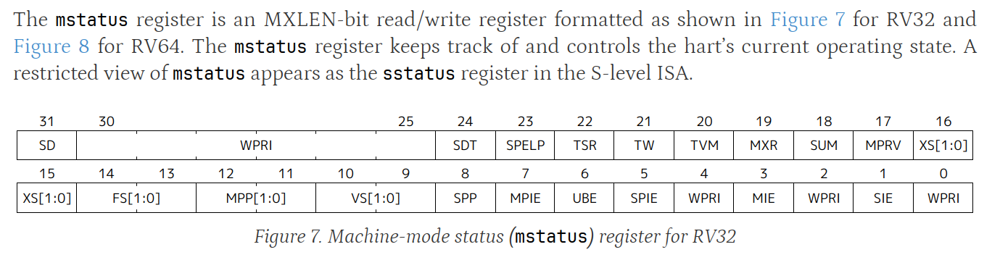
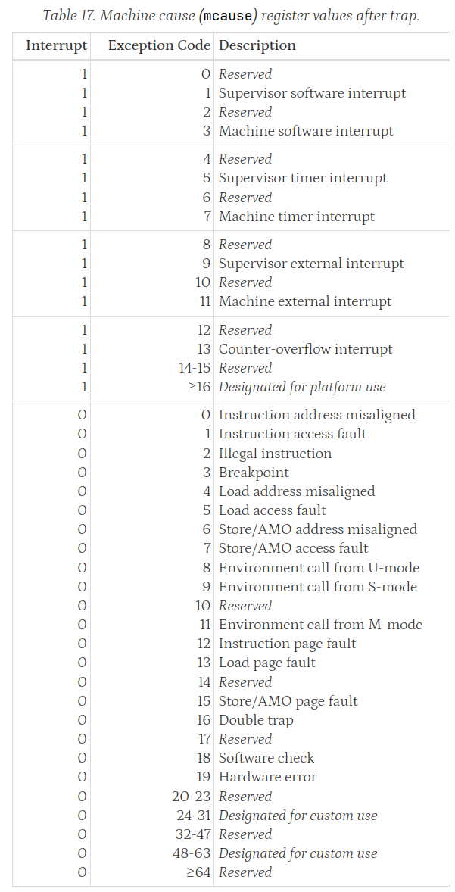
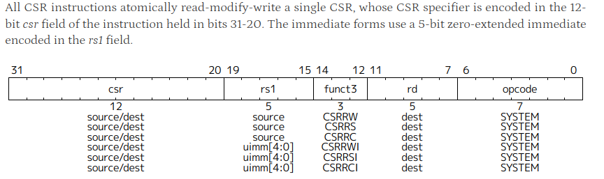

# 实验二 中断

[//]: # (完成流水线 CPU 实验后，你就已经对基于流水线 CPU 的原理和设计有初步认识了。但是这个简单的 CPU 只能按照预先的程序指令一直运行，无法中途打断。然而，我们生活的世界充满了不确定性，一个实用的 CPU 需要能够时刻准备好处理来自外部的事件，及时处理中断，并返回到原来的程序中继续执行。)

完成单周期 CPU 实验后，您实现了一个可以简单的按照预期指令执行的处理器。但是这个简单的 CPU 只能按照预先的程序指令一直运行，无法中途打断。世界充满了不确定性，一个实用的 CPU 需要能够时刻准备好处理来自外部的事件，及时处理中断，并返回到原来的程序中继续执行。

在本实验中，你将学习到：

- CSR 寄存器如何记录信息
- CSR 指令如何修改 CSR 内容
- 中断控制器的原理和设计
- 如何编写一个简单的定时中断发生器

下面的内容中，不管使用 IDE 还是执行命令，根目录是 `lab2` 文件夹。

<!-- ----------------------------------------------------------------------- -->

## 控制状态寄存器 CSR

从预备知识[中断与异常](../../theory/interrupt-and-exception.md)我们已经介绍了中断、异常和陷入的概念，并简单介绍了 CSR 的作用，本节将深入介绍 CSR 的作用。

为了处理各种各样的中断和异常，CPU 需要 控制状态寄存器（Control and Status Register，CSR）以记录信息。
RISC-V 定义至多每个 CPU 核心有 4096 个 CSR，包括 RISC-V 要求实现的及允许 CPU 厂商自定义的。
本实验仅实现 RISC-V 的 Machine 特权级，因此我们只实现 M 特权级下关于中断和异常的 CSR，它们的名称均以 m 开头，包括：`mstatus`, `mtvec`, `mcause`, `mepc`。

关于更详细的 M 特权级下 CSR 定义，可参考 特权级手册 第三章 Machine-Level ISA ，以下从其中摘取将要实现 CSR 的相应内容，您应能阅读并从中理解相应 CSR 的作用。

### mstatus

`mstatus` 寄存器指示中断与异常、特权级等状态，其格式如下：

!!! quote "在 Machine 模式下，`MIE` 位指示当前中断开关 "
      When a hart is executing in privilege mode x, interrupts are globally enabled when `xIE=1` and globally disabled when `xIE=0`. 

!!! quote "中断或异常导致陷入时，记录当前中断启用至 `MPIE`" 
      `xPIE` holds the value of the interrupt-enable bit active prior to the trap, and `xPP` holds the previous privilege mode.
      When a trap is taken from privilege mode y into privilege mode x, `xPIE` is set to the value of `xIE`; `xIE` is set to 0.

!!! quote "从陷入返回时，恢复 `MIE`"
      An MRET or SRET instruction is used to return from a trap in M-mode or S-mode respectively.
      When executing an xRET instruction, supposing xPP holds the value y, xIE is set to xPIE; ... xPIE is set to 1;

---

### mtvec

`mtvec` 是 陷入向量基址寄存器（Trap-Vector Base-Address Register），它记录由中断或异常引发陷入时，陷入处理程序所在的地址。其格式如下：

`BASE` 会由操作系统设置为陷入处理程序的地址。

**`MODE` 字段总设置为 0** ，即所有陷入发生时， `pc` 设置为 `BASE`。`MODE` 设置为 1 时会跳转至 `BASE + 4 * cause` 地址，以便处理不同原因造成的中断，但不在目前实验的考虑范围内。

---

### mcause

`mcause` 记录陷入发生时导致其发生的原因代码，寄存器格式及相应原因代码列出如下：

??? quote "`mcause`原因代码表格"

      {width=80%}

--- 

### mepc

`mepc` 格式与 `pc` 相同，其记录陷入发生时指令的地址：

!!! quote "mepc的设置"
      When a trap is taken into M-mode, mepc is written with the virtual address of the instruction that was interrupted or that encountered the exception. Otherwise, mepc is never written by the implementation, ...

<!-- ----------------------------------------------------------------------- -->
---

## CSR 指令

前面一小节定义了相应的 CSR，那如何让 CPU 的使用者利用这些 CSR 呢？RISC-V 的 Zicsr 扩展提供了 CSR 相关的读写指令，其在非特权级手册的第六章描述如下：

CSR 指令都在一条指令内先读取、再修改 CSR 的内容，`CSRRW`, `CSRRS`, `CSRRC` 区别于如何对 CSR 进行修改。同时它们还有立即数版本（I后缀的 `CSRRWI`, `CSRRSI`, `CSRRCI`）。

!!! quote "CSR 指令操作"
      The CSRRW (Atomic Read/Write CSR) instruction atomically swaps values in the CSRs and integer 
      registers. CSRRW reads the old value of the CSR, zero-extends the value to XLEN bits, then writes it to 
      integer register rd. The initial value in rs1 is written to the CSR. If rd=x0, then the instruction shall not read 
      the CSR and shall not cause any of the side effects that might occur on a CSR read.

      The CSRRS (Atomic Read and Set Bits in CSR) instruction reads the value of the CSR, zero-extends the 
      value to XLEN bits, and writes it to integer register rd. The initial value in integer register rs1 is treated as a 
      bit mask that specifies bit positions to be set in the CSR. Any bit that is high in rs1 will cause the 
      corresponding bit to be set in the CSR, if that CSR bit is writable.

      The CSRRC (Atomic Read and Clear Bits in CSR) instruction reads the value of the CSR, zero-extends the 
      value to XLEN bits, and writes it to integer register rd. The initial value in integer register rs1 is treated as a 
      bit mask that specifies bit positions to be cleared in the CSR. Any bit that is high in rs1 will cause the 
      corresponding bit to be cleared in the CSR, if that CSR bit is writable.

      The CSRRWI, CSRRSI, and CSRRCI variants are similar to CSRRW, CSRRS, and CSRRC respectively, 
      except they update the CSR using an XLEN-bit value obtained by zero-extending a 5-bit unsigned 
      immediate (uimm[4:0]) field encoded in the rs1 field instead of a value from an integer register. 

了解了上述 6 条 CSR 指令后，您应能在 EX 执行单元添加相应的运算操作，CSR 指令在 IF、ID 和 WB 的操作与普通指令相同。

<!-- ----------------------------------------------------------------------- -->
---

## 中断控制器 CLINT

CLINT（Core-Local Interrupt）是 RISC-V 架构中提供简单中断和定时器功能的中断处理器，其在中断或异常发生且中断开启时，将暂停CPU当前执行流，设置好相关 CSR 寄存器信息后跳转到中断处理程序中执行中断处理程序。

关键就是该保存哪些信息到对应的CSR寄存器中，答案就是 CPU 执行完当前指令后的下一个状态，比如当前指令是跳转指令，那么 `mepc` 保存的应该是当前跳转指令的跳转目标地址；以及一些关于中断发生原因的信息。

本实验中，我们希望实现一个支持基本功能的、简单的 CLINT，对于一些特殊情况我们规定：

1. 中断到来时，我们认为应该让当前指令执行完后，再跳转到中断处理程序。
2. `mstatus` 的 `mie`位（machine interrupt enable）记录中断使能，即是否响应中断。如果当前正在执行一条指令以关闭中断使能，但此刻发生外部中断，则规定这种情况不应响应中断。
3. 我们不考虑嵌套中断的情况，即中断处理过程中忽略到来的中断。
4. 仅考虑在 Machine 特权级下的情况。

<!-- 还有一些特殊情况。我们知道外部中断使能由 `mstatus` 内容决定，那么要思考如果当前指令如果是修改 `mstatus` 执行结果是关中断的指令执行时，外部中断到来了，那么下个周期是否应该响应中断？
为了统一起见，我们认为这种情况不应该响应中断，并且我们认为应该让当前指令执行完后，再跳转到中断处理程序。 -->

接下来，我们讨论 CLINT 要处理的情况，包括 进入中断处理 和 完成中断处理。

### 进入中断处理

#### 1. 响应硬件中断

此处将外部设备和定时器的中断归为一类讨论。响应硬件中断时，CPU的工作具体分为两部分：

保存现场，记录CPU当前正在执行程序的下一条指令地址，以便中断处理后恢复执行；以及记录中断信息和设置相应权限。这对应了下面 CSR 上的操作：
   
- `mepc`：保存的是中断或者异常处理完成后，CPU返回并开始执行的地址。所以对于异常和中断，`mepc` 的保存内容需要注意。
- `mcause`：保存的是导致中断或者异常的原因，具体代码请查阅特权级手册。
- `mstatus`：在响应中断时，需要将 `mstatus` 寄存器中的 `MIE` 标志位设置为 `0`，禁用中断。 

然后从 `mtvec` 获取中断处理程序的地址，跳转到该地址执行中断处理程序。

!!! info "扩展知识：操作系统与硬件配合处理中断"
      事实上，中断的处理需要操作系统和硬件的紧密配合。在中断发生前，操作系统就要将中断处理程序写入内存并设置中断跳转向量到 `mtvec` 。
      中断发生时，CPU保存现场并设置中断信息，操作系统还需保存进程上下文并进行资源调度等工作，完成中断处理也类似。
      后续操作系统课程中你将对此有更全面深入的了解。

#### 2. 响应软件中断

`ecall` 和 `ebreak` 指令是触发软件中断的两条 environment 指令。`ecall` 常用于系统调用，例如请求磁盘读写，`ebreak` 更多用于调试。
详见非特权级手册第2章的 Environment Call and Breakpoints 。

这两条指令都将触发中断，CSR 的设置操作与响应硬件中断的相似。不同的是，`mcause` 的设置应参照 environment 相应的代码设置。

### 完成中断处理

不论任何原因进入到中断处理程序后，都需要使用 `mret` 指令以恢复 CPU 原先程序的执行。
这时候其实干的事与响应中断是大致相同的，只不过需要写入的寄存器只有 `mstatus`，跳转的目标地址则是从 `mepc` 获取。

为简单起见，对于 `mret` 时 `mstatus` 的要写入的值，就把 MIE 位置为 MPIE 位（Machine Previous Interrupt Enable）。若 MPIE 为 1 的话 `mret` 就会恢复中断，如果 MPIE 为 0 的话，`mret` 则不改变 `mstatus` 的值。

上述实现没有考虑嵌套中断，且以后实现特权级切换的时侯，`mstatus` 的改变更为复杂。中断的实现在手册中有明确的标准，想进一步了解中断机制的实现可以看特权级手册的 3.1.6.1 小节（Privilege and Global Interrupt-Enable Stack in mstatus register） 以及 9.6节（Traps）。

而异常的现场保存和恢复与中断处理差不多，只不过保存和恢复的内容上有所不同而已，感兴趣的同学可以自行摸索。

###  关于 CLINT 的实现

CLINT 具体的实现方法很多，我们采用纯组合逻辑实现这个中断控制器。由于基于单周期 CPU 且 CLINT 是组合逻辑，所以外部中断到来时，CLINT 会马上响应。
目前 YatCPU 的主仓库的多周期CPU中的 CLINT 采用状态机来实现。

CLINT 需要一个周期就把多个寄存器的内容修改的功能，而正常的 CSR 指令只能对一个寄存器读-修改-写（Read-Modify-Write, RMW）。所以 CLINT 和 CSR 之间有独立的优先级更高的通路，用来快速更新 CSR 寄存器的值，这通过 `CLINT.scala` 中 `io.csr_bundle` 实现。

***

<!-- -------------------------------------------------------------- -->

## 简单的定时中断发生器

我们要实现一个 MMIO 的定时中断发生器——Timer。

MMIO （Memory Mapped I/O）简单来说就是：该外设用来和 CPU 交互的寄存器是与内存一起编址的，所以 CPU 可以通过访存指令（load/store）来修改这些寄存器的值，从而达到 CPU 和外设交互的目的。

目前在没有实现总线的情况下，使用多路选择器实现 MMIO 即可达到目的。原因主要是我们把取指令的操作和 load/store 访存操作分开了，让 Memory 有单独的一个通路进行取指令操作。
因此我们的模型还是一个 CPU 对多个外围设备，不会出现 CPU 的取指操作与访存操作冲突争抢外设的情况。

所以我们 CPU 发出的逻辑地址要发送到哪个设备，就由逻辑地址的高位作为外围设备的位选信号即可，低位则用于设备内部的寻址。

此外还有定时中断发生器的内部逻辑：两个控制寄存器 `enable` 寄存器和 `limit` 寄存器。

- `enable` 寄存器用来控制定时中断发生器的使能，为 `false` 则不产生中断， 映射到地址空间的逻辑地址为 0x80000008。
- `limit` 寄存器用来控制定时器的中断发生间隔，映射到地址空间的逻辑地址为 0x80000004。中断发生器内部有一个加一计数器，当计数器的值到达 `limit` 为标准的界限时，定时器会发生一次中断信号（`enable` 使能情况下）。注：产生中断信号的时长没有太大关系，但是至少应该大于一个 CPU 时钟周期，确保 CPU 能够正确捕捉到该信号即可。

<!-- -------------------------------------------------------------- -->

## 实验任务

!!! note "实验任务：支持中断处理"

    1. 使 CSR 寄存器组支持 CLINT 和来自 CSR 指令的读写操作。
    2. 使 EX 单元支持 CSR 指令的运算。
    3. 实现 CLINT，使其能正确设置 CSR 并 完成中断处理。
    4. 使定时中断发生器可以正确产生中断信号，并且实现 Timer 寄存器的 MMIO。

    请在 `// lab2(CLINTCSR)` 注释处完成上述支持，并通过 `CPUTest`、`ExecuteTest`、`CLINTCSRTest`、`TimerTest` 测试。

EX 执行单元的代码文件位于 `src/main/scala/riscv/core/Execute.scala`

CSR 寄存器组的代码文件位于 `src/main/scala/riscv/core/CSR.scala`

CLINT 的代码文件位于 `src/main/scala/riscv/core/CLINT.scala`

Timer 的代码位于 `src/main/scala/peripheral/Timer.scala`

!!! tip
      IDEA 可以双击 shift，vscode 可以 shift+P 以打开文件快速搜索面板。

<!-- 在上面提到的 EX、CSR、CLINT、Timer 四个单元的相应文件里面，请在 `// lab2(CLINTCSR)` 注释处填入相应的代码，使其能够通过 `CPUTest`、`ExecuteTest`、`CLINTCSRTest`、`TimerTest` 测试。 -->

<!-- 如果能够正确完成本次实验，那么你的 CPU 就可以运行更加复杂的程序了，可以运行一下俄罗斯方块程序试试，如果想要上手玩的话，也许需要一个串口转接板，这样就可以通过电脑的键盘通过 UART 串口给程序输入字符了。 -->

## CPU架构图

***

## 实验报告

1. `CLINTCSRTest.scala` 中添加了 CLINT 处理硬件终端和软件中断的两个测试，请您选择至少一个，并：
      1. 简述这个测试通过给部件输入什么信号，以测试 CLINT 的哪些功能？
      2. 在测试波形图上，找到一次从开始处理中断到中断处理完成的波形图，并挑选其中关键的信号说明其过程。例如硬件中断的测试中，有在跳转指令和非跳转指令下的两次中断处理测试；软件中断则分别测试了 `ecall` 和 `ebreak` 两次中断，选择其中一次即可。
2. `CPUTest.scala` 中新增了 `SimpleTrapTest`，其执行 `csrc/simpletest.c` 的程序。请您：
      1. 简述该测试程序如何测试 CPU 的中断处理正确性。
      2. 在测试波形图上找出说明该程序成功执行的信号。
3. 假如我们的 CPU 上运行着某个操作系统，并在启动后向 `mtvec` 写入了中断处理程序的地址。若在执行程序时发生 定时器中断，CPU 及操作系统会如何协作完成该中断处理？请查阅课本、网络资料或辩证地使用大语言模型，简述这个过程。
4. 说明您在完成实验的过程中，遇到的实验指导不足或改进建议。

