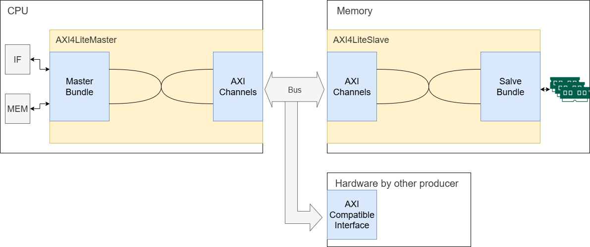

# 实验四 总线

总线为 CPU 访问多个外部设备提供了高性价比的解决方案。
总线的目的是减少电路布线数量以及电路设计复杂度，避免 CPU 和外部设备之间全连接。通过统一的总线抽象，CPU 使用总线协议访问外部设备，而无需知道其细节，具体的硬件操作则进一步抽象为读写硬件设备上的寄存器。

在本实验中，您将学习到：

- AXI4-Lite 协议
- 使用状态机实现总线协议

在开始实现 AXI4-Lite 总线协议前，请您阅读 [总线](../../theory/bus.md) 以了解 AXI4-Lite 协议的基本知识。

不管使用 IDE 还是执行命令，根目录是 `lab4` 文件夹。

## 框架与接口总览

/// caption
本实验中使用 AXI4-Lite 协议通信的框架图
///

为了使基于多周期流水线的 CPU 拥有使用 AXI4-Lite 协议与外部通信的能力，本实验中修改了 CPU 部件之间、CPU与外部设备之间 的通信框架，如上图所示：
左侧的 CPU 和右侧的 内存模块使用 AXI4-Lite 协议通信，但 AXI4-Lite 的通信协议较为复杂，我们将 AXI4-Lite 的通信实现包装在类 `AXI4LiteMaster` 和 `AXI4LiteSlave` 中，使得需要调用 AXI4-Lite 通信的硬件直接使用这两个类即可。

在 `AXI4LiteMaster` 和 `AXI4LiteSlave` 之间通信的接口是 `AXI4LiteChannels` ，其包含 AXI4-Lite 所定义的 5 个通道及相应信号线。当您实现自己的 `AXI4LiteMaster` 和 `AXI4LiteSlave` 后，您的硬件设备就可以和其他厂商的设备进行通信，只要其支持 AXI4-Lite 协议。

`AXI4LiteSlaveBundle` 和 `AXI4LiteMasterBundle` 是本实验中硬件操纵 `AXI4LiteMaster` 和 `AXI4LiteSlave` 的接口，其接口定义比 AXI4-Lite 简单得多，为的就是用简单地把读写操作告知 `AXI4LiteMaster` 或 `AXI4LiteSlave`，并由它们执行。

为让您更好地理解，上面的框架可以比作用户用不同语言向手机输入消息，手机通过无线网络传输信息。CPU 内需要通信的部件如同一个用户，需要和另一个用户 —— 内存进行通信，于是我们开发了一种遵循无线通信协议的手机，手机对应于  `AXI4LiteMaster` 和 `AXI4LiteSlave`，通信协议则对应于符合 AXI4-Lite 规范的 `AXI4LiteChannels` 。用户使用语音输入，即 CPU 或 内存通过 两个 `Bundle` 将读写操作告知 `AXI4LiteMaster` 和 `AXI4LiteSlave`，而两台手机之间的通信则对应总线上以 AXI4-Lite 的通信。

您在此处的工作就是打造一部这样的手机，使得不仅两台您造出的手机能相互通信，也能和其他厂商的手机进行通信。

{width=70%}
/// caption
将本实验 AXI4-Lite 通信框架比作用户通过语音输入消息通信
///

## 设备与  `AXI4LiteMaster` 和 `AXI4LiteSlave` 通信

这一部分对应上图类比中如何实现不同  用户☺️  语音输入到  手机📱  的部分。

主机侧（Master）的通信接口在 `AXI4Lite.scala` 中 `AXI4LiteMasterBundle`定义，各信号含义为：

| 信号                   | 含义及时序要求                  |
| -------------------- | ------------------------ |
| address              | 读或写地址                    |
| read                 | 执行读操作，每个操作该信号置1持续1周期     |
| write                | 执行写操作，每个操作该信号置1持续1周期     |
| read_data/write_data | 读写数据                     |
| write_strobe         | 写选通                      |
| read_valid           | 读完成，当从设备返回数据时，该信号置1持续1周期 |
| write_valid          | 写完成，当从设备确认写入后，该信号置1持续1周期 |
| busy                 | `AXI4LiteMaster`正忙，暂不接收任何读写请求       |

这样，CPU 作为主动发出读写请求的一方，其通过 `read`, `write`, `write_data` 和 `address` 发出请求，并等待 `[read|write]_valid` 信号以得知操作完成。
相应地，内存、定时器、键盘等作为被动接收读写请求的一方，其需要提供 `read_data` 和  `[read|write]_valid` 信号。

!!! question "为什么需要 valid 信号"
    valid 信号指示数据有效或操作完成。例如读操作完成并在 `read_data` 传回数据时，需要 `read_valid` 来指示此时 `read_data` 上是有效的数据。这一方面是因为 `read_data` 不会一直保持，另一方面也不知道读请求发送后过多久能读回。 `read_valid` 的作用就像提醒您外卖到了的短信。

## 用状态机实现总线协议

本实验的主要内容就是实现 AXI4-Lite 总线协议里面的主从设备间的读写流程的状态转换。
这对应之前类比中手机📱 间通过某种无线协议进行通信。

为简单起见，我们使用状态机来实现 AXI4 接口，即 `AXI4LiteMaster` 和 `AXI4LiteSlave` 用状态机实现，在握手完成时进行状态转换，以此逐个完成事务。
我们给出一个可参考的状态机，如下图，左图是主设备总线接口的状态机，右图是从设备总线接口的状态机：

### 进行一次读操作

现在我们以 CPU 取指令过程为例，说明如何进行一次读操作。

首先，取指阶段（IF）发出取指信号，包括将 `AXI4LiteMasterBundle` 的 `read` 置 1，并将 PC 送至 `address`，
此时 CPU 的 AXI 主机（AXI Master）收到 IF 的信号，主机内部状态由空闲（Idle）跳转到 读地址状态 (ReadAddr)，产生并发送读请求 (`ARVALID`)、读地址 (`ARADDR`)。

当内存模块的从机（AXI Slave） 收到 `ARVALID` 时，其内部状态跳转至 读地址状态 (ReadAddr)，保存 `ARADDR` ，并将 读地址准备(`ARREADY`) 信号置 1 表明读地址已收取，此时即完成了一次握手，并完成读地址的传输。获取读取地址后，从机通过 `AXI4LiteSlaveBundle` 告知内存芯片读取指定位置的数据，并等待读操作完成。

当内存芯片读回数据时，其通过 `read_valid` 和 `read_data` 传回。从机 跳转至 读数据状态 (ReadData) ，将读回数据传入 读数据 (`RDATA`)、读返回请求 (`RVALID`)；主机此时也转移至 读数据状态 (ReadData)，并将 `RREADY` 置 1，表明准备好接收读出的数据。

当主机发现 `RVALID` 和 `RREADY` 均为 1 时完成握手，其将读出数据 `RDATA` 通过 `AXI4LiteMasterBundle` 的 `read_data` 传回至 IF，同时将 `read_valid` 置 1 持续 1 个时钟，表明这次读取操作成功，随后主机重返空闲。

另一边，当从机发现 `RVALID` 和 `RREADY`完成握手时，其也重返空闲状态。

当主机不在空闲状态时，其将 `busy` 置 1，“婉拒”期间到来的请求。

###  如何进行写操作

相比读操作，写操作的流程还需写反馈的握手，若您理解了读操作的机制，写操作应不成问题。

!!!tip "状态机的具体实现"
    我们提供了灵活的测试方法，主从机的状态转换可以不必按照上面所说的一字不差，只需要能达到测试中要求的读写正确、功能正常即可。您可观察测试产生的波形图，从而优化实现以减少读写操作的周期数，甚至跳过某些上述的主从机状态。

## 总线上的 MMIO

CPU 的内存空间按地址划分为多个部分，分别与不同设备通信。目前的实验代码中，CPU 使用地址的高 3 位以选择设备：`b000` 映射至内存，`b010`映射至 UART，`b100` 映射至定时器。

`BusSwitch.scala` 中包含了已实现上述功能的多选交换器，具体的接线在各 `Top.scala` 中满足了上面说明的映射关系。

## 把总线加到流水线上

从预备知识里面我们知道了需要有总线仲裁这个模块，来协调总线主机响应来自 CPU 哪个阶段的读写请求信号。

目前我们的流水线上，无论是三级还是五级，都只存在 取指单元 和 访存单元 之间的冲突。这显然也是一种结构冲突（Structural Hazard），所以可以用 Lab 3 实验中解决冲突的思路：阻塞流水线以保证指令流的执行，即如果访存阶段没有占用总线，取指单元 才能够取指。

---

## 实验任务

根据前面的主从设备状态机，实验代码框架已准备好相应寄存器及 IO 接口，您主要关注实现状态机。
若您修改或改进了主从设备状态机，您应简述其逻辑或给出相应图例。

!!! note "实验任务：实现 AXI4-Lite 协议主从机" 
    主从设备的代码位于 `src/main/scala/bus/AXI4Lite.scala`，请在标有 `//lab4 (BUS)` 的注释处，实现AXI4Lite主从机的内部逻辑，并：

    - 通过 `src\test\scala\riscv` 下的 `BusTest.scala`，和三级、五级流水线下的 `CPUTest.scala` 中的测试
    - 查看 `BusTest` 中 `FunctionalTest` 输出的读写事务消耗了多少个周期
    - 查看 `CPUTest` 中 `Fibonacci` 和 `Quicksort` 输出的消耗时钟周期

!!! tip "如何检测自己实现的 AXI4-Lite 主从机正确性"
    上一版的测试代码要求严格按照给定状态机实现，这一版提供了允许自由实现 AXI4-Lite 协议的测试，并加入测量读写事务耗时的功能。
    
    若您发现代码无法通过测试，可以查看 `BusTest.scala` 中 `FunctionalTest` 产生的波形图，并查看相应通道的信号，来了解自己实现能否完成最基本的读和写操作。该方法也可助您改进实现，减少读写操作的周期数。

## 实验报告

1. 简述您的 AXI4-Lite 主从机实现逻辑。如果有，描述您通过什么方法改进了实现及性能提升。
2. 简要概括`BusTest`中测试的原理，以及测试用例的执行结果。
3. 【可选】参考[硬件调试](../../practice/hardware-debug.md)一节的内容，用硬件波形的方法捕获程序运行结果。分析 Vivado 是否能正确识别并组合 AXI4 总线协议的传输信号以及过程。
4. 在完成实验的过程中，遇到的关于实验指导不明确或者其他问题，或者改进的建议。 

---

## 更多关于总线的知识

实际上把总线加到我们原来的 CPU 上后，会发现 IPC 大幅下降。

主要原因是总线握手花费了大量的时间。而 AXI4-Lite 协议又是 AXI4 协议的简化版本。为了实现上的简单，所以没有实现突发传输（burst）的功能，所以每次最多读写一个数据总线宽度的数据，即每次都需要重新进行各个读写通道的握手，导致效率很低。

解决的一个办法就是加缓存。根据局部性原理，我们可以为取值单元与内存之间加上指令 Cache（I-cache），为访存单元与内存间加上数据 Cache（D-cache），这样就可以加速数据的存取。

而这样的实现方案里面 D-cache 和 I-cache 同样是需要通过总线访问内存的。但是由于 Cache 是以 Cache Line 为单位存取的。假设一个 Cache Line 为 128 字节，当我们的总线数据位宽为 4 字节的时候，填充缓存行需要从内存读 128 / 4 = 32 次，
并且这每一次需要重新进行读地址握手、读数据握手。而 AXI4 协议就是在AXI4-Lite的基础上加上了 Burst 的功能，即在读写请求中可以指定传送数据的个数，从指定地址传连续的多个数据给从机，
而读数据握手时，就可以连续获取相应的那么多个数据。这样的协议就是突发传输（burst），为了实现这个协议，主从设备为了握手通信，需要设置更多的寄存器（指定读取数据个数的 RLEN，指示是否为最后一个数据的 RLAST 等），状态机转换也需要更为复杂。

这样一来我们从两个方面来加速我们的 CPU，一是 Cache，我们不需要通过总线来获取数据；二是实现完整的 AXI4 协议。而从理论上来说，如果实现了 Cache 而没有实现 AXI4 的 burst 机制，加速效果也不会很明显。所以可以先实现 Cache 然后实现 burst 来体会一下。

## What's next? 

同学们在完成了本实验后，就应该具备根据状态转移图来实现状态机的能力了。如果有兴趣的话，可以尝试一下实现简单的 Cache，然后再实现 burst。包括后面希望实现 MMU，最简单的实现也可以用状态机来实现。所以，你可以放开手脚在 YatCPU 的基础上探索了（当然你也可以自己从头实现）。

实现好总线模块的逻辑后，你可以尝试给 Lab 3 的基础上或者是给 Lab 2 的 CPU 接上总线（现有的 YatCPU 的五阶段流水线+总线代码里面的一些逻辑问题在 Lab 3 实验代码中修复了，但是还没有合并到主仓库，Lab 4 用的还是主仓库现有的代码）

此外同学们也可以思考如何做CPU设计架构的优化，比如现在的 CPU 只有 ID 和 MemoryAccess 阶段对总线有需求，所以总线仲裁比较简单（集成在 `CPU.scala` 里了）。但是如果后面再加上 MMU，那么 CPU 的总线主机模块应该由哪个模块使用，这部分逻辑就会变得更复杂点，而这部分逻辑其实是可以单独拿出来实现的。

