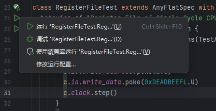
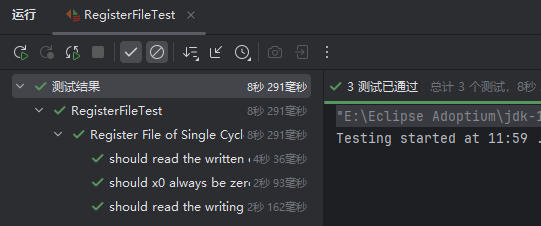
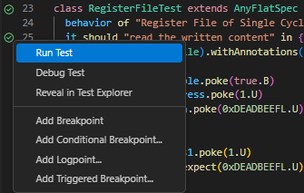
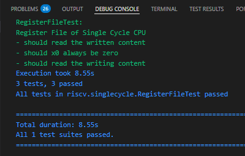
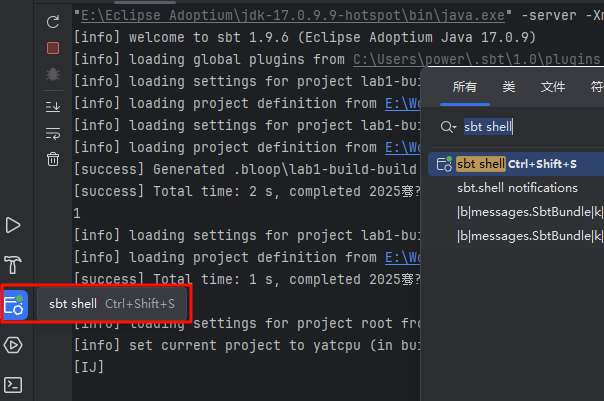
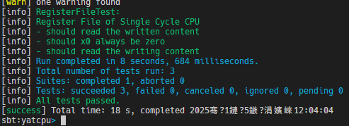
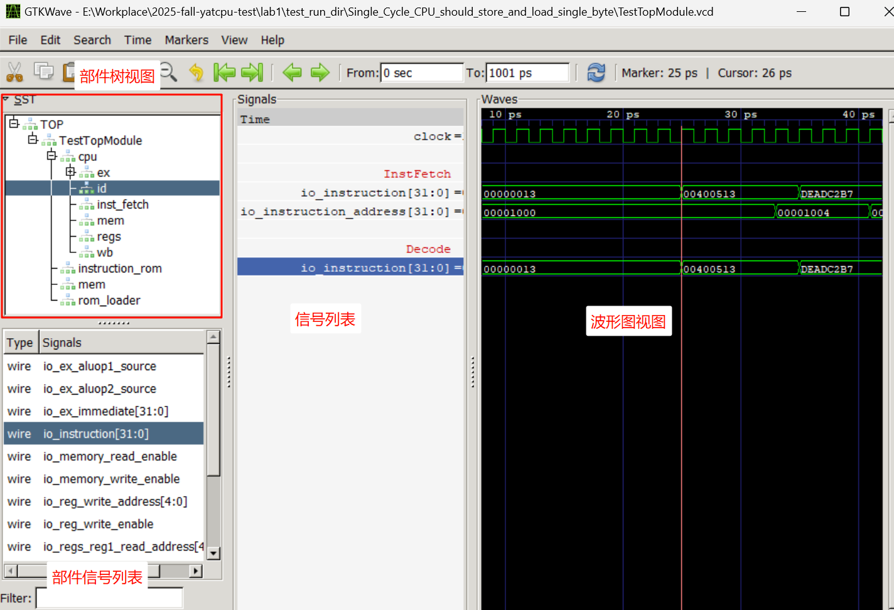
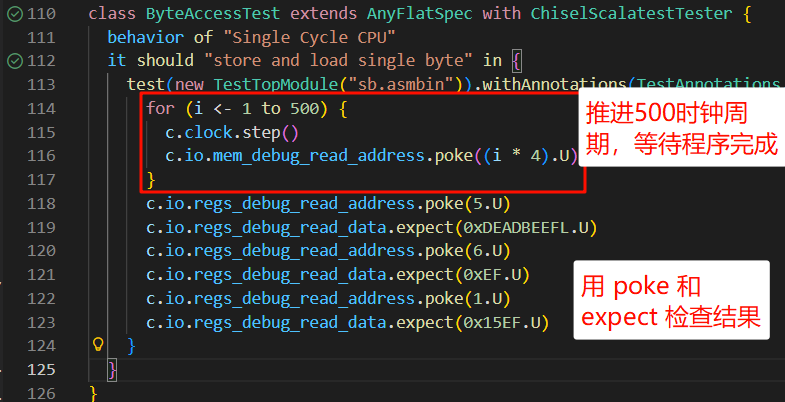
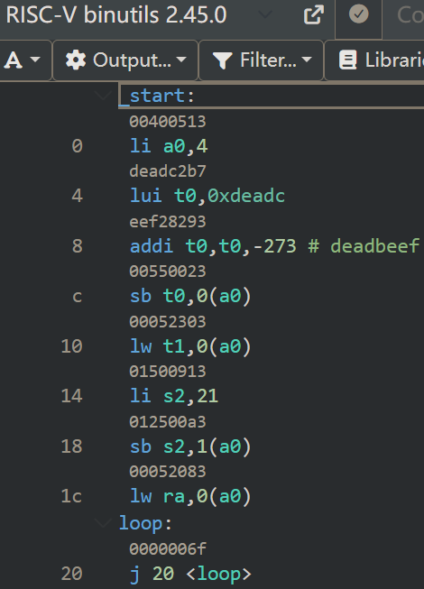

# 运行测试并解读波形图

By: [:material-github: howardlau1999](https://github.com/howardlau1999)、[:material-github: PurplePower](https://github.com/PurplePower)

当您实现 CPU 后，可通过仿真测试以验证，并查看波形图以进一步分析测试过程及硬件运行情况。
在本教程，您将了解如何执行仿真测试，并解读波形图。


## 运行测试并生成波形图

当您完成实验中的代码时，您有多种方法执行测试。

!!! tip "波形图生成的启用注释"
    若您使用 Scala 和 Chisel 测试，仓库默认于 `TestAnnotations` 中定义了 `WriteVcdAnnotation`，以生成波形图。
    若您自定义了某些超长周期测试，您可以去掉其以避免生成波形图占据大量磁盘空间。


=== "使用 IDE 界面"

    您可直接在 IDEA 或 VSCode 中点击测试文件中测试旁运行按钮，即可运行测试。该方法最为直接简单。


    === "IDEA"
        点击测试左侧的运行按钮，选择“运行”或“调试”，即可启动测试。

        {width=70%}

        测试成功时，您应能在运行或调试标签页里看到测试通过提示：

        {width=70%}

    === "VSCode"
        左击测试左侧的运行按钮，或右击选择运行或调试以启动测试。

        {width=70%}

        测试完成时，您应能在 Debug Console 看到测试结果：

        {width=70%}


=== "使用 sbt（Linux仅命令行）"

    sbt （Scala Build Tool）可用于自动编译并运行项目。该方法适合习惯终端界面的同学。

    首先，您需要打开 sbt ：

    === "IDEA 中打开"
        在 IDEA 界面左下角点击打开 sbt shell，或双击 ++shift++ 搜索 sbt shell 以打开。

        {width=70%}

    === "命令行中打开"

        在键入 `sbt` 并确认前，您需确认以下事项避免测试失败。

        ???+ tip "设置代理"
            首次打开 sbt 时，其会在编译时自动下载依赖库。如果下载失败或者网络不稳定，可以尝试设置代理。请根据自己的实际情况填写代理地址。
            ```bash
            export HTTPS_PROXY=http://127.0.0.1:1080
            export JAVA_OPTS="$JAVA_OPTS -Dhttps.proxyHost=127.0.0.1 -Dhttps.proxyPort=1080"
            ```

        ???+ tip "确认 Java 版本"
            由于本实验的 Scala 和 Chisel 版本，Java 版本需要为 17 或 19 。您可以通过以下命令确认您系统上的 Java 安装。

            ```bash
            > java --version  # 查看默认 java 的版本
            openjdk 17.0.9 2023-10-17
            OpenJDK Runtime Environment Temurin-17.0.9+9 (build 17.0.9+9)
            OpenJDK 64-Bit Server VM Temurin-17.0.9+9 (build 17.0.9+9, mixed mode, sharing)

            > which -a java   # 查看所有 java 的路径，第一项是默认 java
            /e/Eclipse Adoptium/jdk-17.0.9.9-hotspot/bin/java
            ```
        
    随后，您可以打开 sbt 。

    ```bash
    sbt

    # 使用指定的 JAVA 以启动 sbt
    sbt --java-home <JAVA路径>
    ```

    在 sbt 中，您可以使用如下指令运行全部测试。初次运行或修改文件后，可能花费较长时间进行重新编译。

    ```bash
    test
    ```

    或使用 `testOnly` 以运行指定的测试，指定测试的名称是文件开头的 `package` 包名，用句号接上测试 class 的名称，如运行 `RegisterFileTest.scala` 中的 `RegisterFileTest` 测试，则使用：

    ```bash
    testOnly riscv.singlecycle.RegisterFileTest
    ```

    运行结束时，您应能看到测试结果：

    


=== "使用 C++ 和 Verilator"

    !!! question "Why?"
        前两种测试方式中均由 Chisel 调用了 Verilator 进行模拟，使用 C++ 调用 Verilator 编译运行给予更大的模拟自由度。
        该方法将 Verilator 中模拟耗时的大容量内存拆出由 C++ 数组替代，**请仅在确有该需求时才使用该测试方式。**


    按以下随意一个方式为您实现的 CPU 生成 Verilog 代码。

    === "使用 IDEA"
        打开 `src/main/scala/board/verilator/Top.scala`，点击 `object VerilogGenerator` 一行左边的绿色三角形运行即可。

        或者可以在 "sbt shell" 窗口中，等 sbt 启动完毕后，执行 `runMain board.verilator.VerilogGenerator`。

    === "使用命令行"
        ```bash
        sbt "runMain board.verilator.VerilogGenerator"
        ```

    之后，进入 `verilog/verilator` 目录，执行以下命令生成仿真程序：

    === "Linux/macOS"
        ```bash
        verilator --cc --exe --trace --build Top.v sim_main.cpp
        ```
        或
        ```bash
        verilator --cc --exe --trace Top.v sim_main.cpp
        make -C obj_dir -f VTop.mk
        ```

    === "Windows"
        ```bash
        verilator_bin --cc --exe --trace --build Top.v sim_main.cpp
        ```
        或
        ```bash
        verilator_bin --cc --exe --trace Top.v sim_main.cpp
        make -C obj_dir -f VTop.mk
        ```

    编译完成后，会生成 `obj_dir/VTop` （Windows 下为 `obj_dir/VTop.exe`）的可执行文件。该可执行文件可以传入参数从而运行不同的代码文件。参数以及其用法如下：

    |参数|用法|
    |----|-----|
    |`-memory`|指定仿真内存的大小，单位为字（4字节）。用例：`-memory 4096`|
    |`-instruction`|指定用于初始化仿真内存的 RISC-V 程序。用例：`-instruction ~/yatcpu/src/main/resources/hello.asmbin`|
    |`-signature`|指定仿真结束后，需要输出的内存范围以及目的文件。用例：`-signature 0x100 0x200 mem.txt`|
    |`-halt`|指定停机标识符地址，往该内存地址写入 `0xBABECAFE` 即停止仿真。用例：`-halt 0x8000`|
    |`-vcd`|指定仿真过程波形保存的文件名，不指定则不会生成波形文件。用例：`-vcd dump.vcd`|
    |`-time`|指定最大仿真时间，注意时间是周期数的两倍。用例：`-time 1000`|

    例如，如果想加载 `hello.asmbin` 文件，仿真 1000 个周期，并将仿真波形保存到 `dump.vcd` 文件，可以运行：

    ```bash
    obj_dir/VTop -instruction ~/yatcpu/src/main/resources/hello.asmbin \
    -time 2000 -vcd dump.vcd
    ```

    另外，使用 Verilator 仿真时，向内存地址 `0x40000010`（也即 UART 的 MMIO 地址）写入的数据将转换为字符输出到标准输出，可以用来实现 `printf` 等功能，方便调试。 

    


---


## 解读波形图


### 打开波形图


我们推荐您使用 GTKWave 以查看波形图：

- [Windows 版本](https://sourceforge.net/projects/gtkwave/files/gtkwave-3.3.100-bin-win64/gtkwave-3.3.100-bin-win64.zip/download)，解压后运行 `bin\gtkwave.exe`
- [macOS 版本](https://sourceforge.net/projects/gtkwave/files/gtkwave-3.3.107-osx-app/)
- [Linux 源码](https://sourceforge.net/projects/gtkwave/files/)

除此之外，VSCode 还可使用 [Vaporiew](https://github.com/Lramseyer/vaporview) 扩展查看。

使用 GTKWave 打开测试生成的波形文件，如 `test_run_dir` 下对应测试的 `.vcd` 文件，您应看到如下界面：



以下是一些简单的操作：

- 在部件树视图，您可以逐级展开所测试的部件，并选择部件，该部件里的信号会显示在下方的信号列表。
- 双击信号，其会被添加到信号列表和波形图视图，右击信号列表可以添加空行和红字注释，右击信号可以修改其颜色及 Data Format 中显示进制。
- 使用滚轮使波形图在时间轴上移动，使用 ++ctrl++ + 滚轮缩放。
- 选择信号后，从 Search - Pattern Search 窗口可以搜索特定信号值的出现时刻。
- 左击波形图以放置红色标记线，其指向时刻各信号的值显示在 信号列表右侧。
- 使用鼠标中健放下白色标记线，使用 Markers 菜单下的选项放置或收回黄色的标记线。
- 使用 File - Write Save File 选项保存当前的信号布局为 `.gtkw` 文件，这样打开该文件时，将恢复目前的信号选择及视图。


### 分析波形图

要分析波形图，您必须结合产生波形图的测试。例如，上方图片展示了单周期 CPU 执行 `csrc/sb.S` 中程序的波形图，其对应 `CPUTest.scala` 中 `ByteAccessTest`。首先，Scala 的代码控制了时钟推进及输入输出信号，从而检查执行正确性。

{width=70%}

这可以帮助您了解某些 `poke` 和 `expect` 信号出现于何时，如上述对 `regs_debug_read_[address|data]` 信号的读写，会在波形图视图的最后一个周期。

然后，您应查看该测试所运行的二进制文件，即 `csrc/sb.S` 编译所得的指令。您可以使用 [godbolt](https://godbolt.org/) 以了解编译后的具体二进制指令，查看二进制的方法适用于指令很少的测试。

{width=60%}

结合前述 GTKWave 波形图，能够从 IF 和 ID 的 `io_instruction` 信号看出其正逐条执行指令。分析方法可以运用到其他测试，包括您自己写的其他测试。

